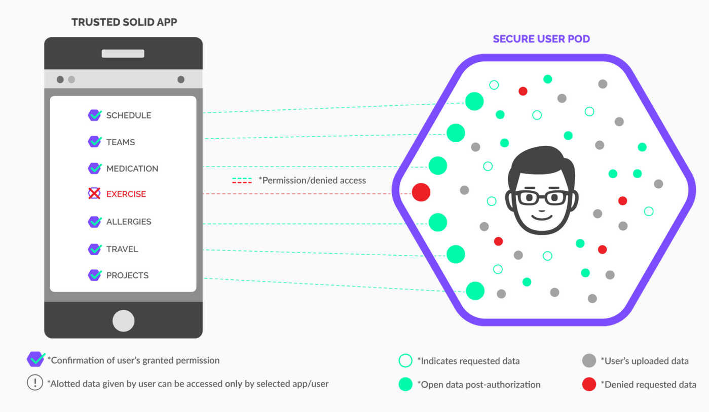

### Why Choose Pods?

- When you want to allow for users to choose when, where, and with whom to share access to their profile details.

### The Design Problem

In many social applications, users are identified by some public or semi-public
profile page. This profile is often centralized, i.e., there is one central
source of truth for who a particular person is. However, some users may not always
want to keep a static profile for all interactions online. In a centralized
application, this usually means creating multiple accounts and switching
between accounts when desiring to share different profile details with
different people. 

### The Design Solution

Store as much identifying information as possible on the user's device, and as
little as possible identifying information on any service. Any time another
service or user requests profile information, the application provides a consent
flow that allows the user to choose which profile details (or none at all) to
share with the requester. 

### Examples

::: examples

- [ Solid 'pods' require apps to ask for access](solid.png)

::: 

### Best Practice: How to Implement Conditional Identity

### Potential Problems with Conditional Identity

- **Guaranteeing anonymity is hard.** Clearly communicate the risks to users who
  are using conditional identities.
- **Spam and harassment.** Conditional identities should be paired with
  invite-only groups and contact requests for private messages. Implement
  strong anti-abuse features for public communities and content.

### The Take Away

