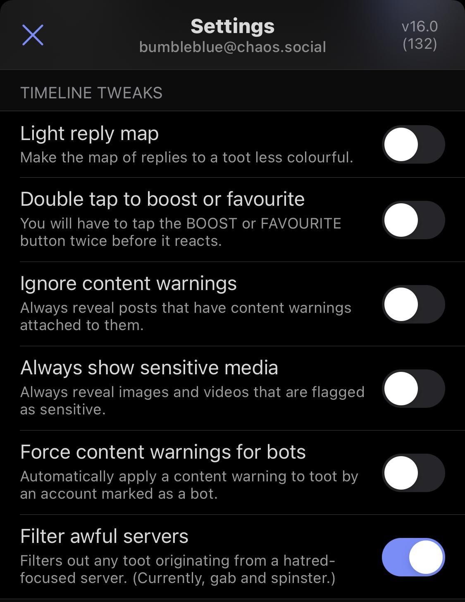

## The Design Problem

Decentralized social network providers struggle to decide between displaying
everything and allowing users to choose certain filter options. This requires a lot of overhead in managing user feeds, and
restricts user choice in what they are able to see.

## The Design Solution

Users can pick third-party organizations, applicatoins, or services to curate
their content feed. Make it easy for developers to write programs that provide
curation for social network feeds. Allow users to choose what algorithm(s) they want to use.

## Examples

::: examples

- [ Mastodon gives you the option to filter out "awful servers"](Mastodon.jpeg)

- [ Twitter lists allow you to select content from a specific group](Twitter_lists.jpeg)

:::

- CTZN
- Aether

## Why Choose Content Curators?

- When you want to give users choice, flexibility, and control over feeds.
- When you want to enable an ecosystem or marketplace of filters & algorithms.

## Best Practices: How to Implement Content Curators?

- Only place trusted and verified third parties in the role of content curators.
- Allow users to access more interesting and relevant content and therefore
  fosters a stronger and meaningful relationship with their network.

## Potential Problems with Content Curators?

- Keep in mind that not all algorithms are necessarily good
  at curating content. In addition, they will each have their own biases. This can be made clear to users by including descriptions about each algorithm and what they do.
- The added value of this pattern will depend on if content curators are vetted properly or if it is easy to use.

## The Take-Away

This is more of an opt-in option rather than a catch-all solution for curating feeds.
