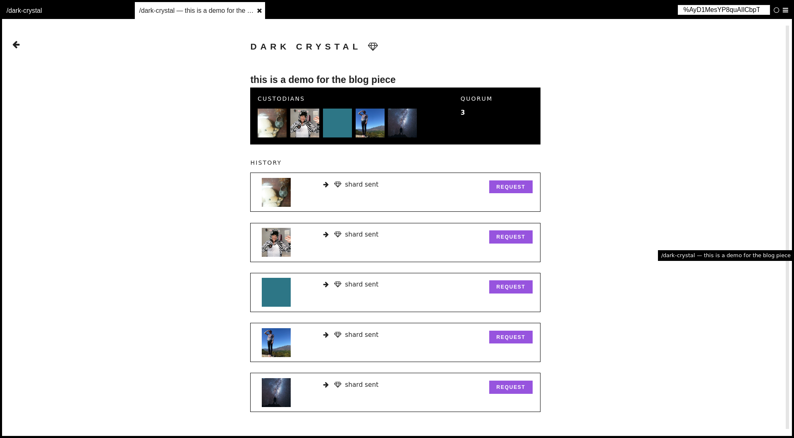

## The Design Problem

Managing your "secrets" (like keys and passwords) is hard! If they are saved only on
a single device, they are highly secure because someone must gain possession of
your device to get your secrets. But these secrets can be gone forever if the
device is lost or stolen, so this approach can be highly risky. If your secrets are uploaded to
a server owned by another person, company, or organization, it's highly
available anywhere even if you lose your device. But it is possible that an
attacker or rogue employee may lose, corrupt, or misuse it (intentionally or
unintentionally).

Thus, gaining trust thus has become an important part of marketing strategies
for many Internet companies today that store your important information. This
is why many companies focus on creating a social, friendly, and trusted image
in their brand.  

## The Design Solution

Because trust is inherently social, we can also model secret management in a social
way. Secret sharing allows you to share your secret with a number of
people - friends, family members, or any organization you place your trust in!

If you lose your original secret, these people (peers) could choose to come together to
recreate your secret for you. Secret sharing is also known as "sharding" -- think about breaking up a secret
into different shards, spread across a number of peers. Thanks to some mathematical magic (cryptography!) no
single peer can recreate your secret with their shard. This prevents a single attacker or rogue
employee from stealing your secret, as they would need to coordinate with
a number of your peers to unlock the secret.

## Examples

::: examples

- [ Dark Crystal in Secure Scuttlebutt](secret-history-screenshot.png)

:::

## Why Choose Secret Sharing?

Secret sharing is great in a scenario where users have to maintain a single secret across all of their
devices, and losing that secret can be catastrophic. For example, in
applications that manage sensitive information such as money, personally
identifying information, or encrypted documents.

## Best Practice: How to Implement Secret Sharing

Allow users to choose a minimum number of peers that need to come together to
re-create the secret. The number of peers can be small, as little as two. Most
users may not need more than two or three peers to have a high guarantee of
security and usability.

Despite only needing two or more peers to use secret sharing, it's important
that more peers are included just in case something goes wrong with a peer. For
example, recommend that the user create at least three shards with two minimum
peers, or five shards with at least three minimum peers. This way, if one of
the peers is unable or unwilling to participate at a later date, the secret
won't be lost.

## Potential Problems with Secret Sharing

The simplest way to implement secret sharing likely requires the users to
distribute the secret shards to peers themselves in an ad-hoc manner. There
are three significant problems:

1. The shard could be stolen by an unauthorized third-party.
2. The shard could be lost by the intended recipient.
3. The shard could be rendered invalid because one of the peers went rogue.

The shard distribution workflow could be automated through a user interface on
the application to make it easier for users to create, send, and revoke keys
over encrypted channels, but that is not always an easy task for development
teams to build and deploy.

## The Take Away

Secret Sharing is a protocol that models trust in a social and distributed fashion.

## References & Where to Learn More

[Dark Crystal](https://darkcrystal.pw/what-is-secret-sharing/)
