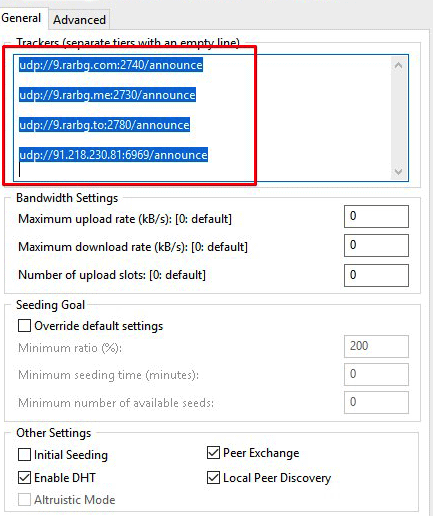
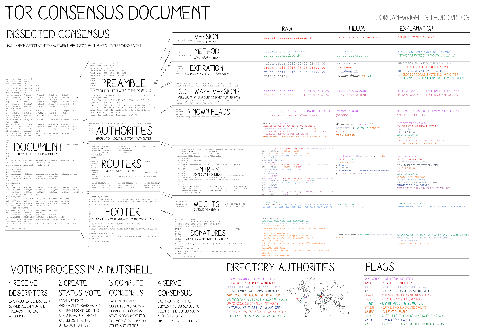
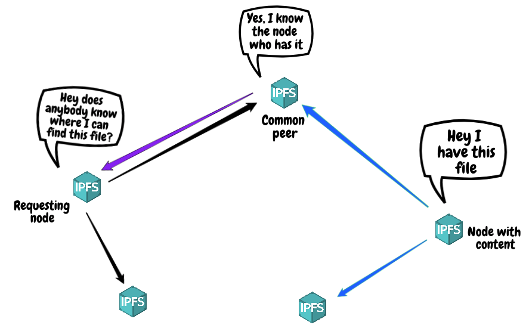

### The Design Problem

On centralized social networks, users can identify content and peers relevant to their own interests and "follow" or "subscribe" to the content. The platform provides the supporting infrastructure to connect with peers and browse available content.

This is not always true in peer-to-peer systems. Once a user found peers offering relevant content, they can ask those peers for contact information for adjacent peers, and connect to a larger portion of the network - but finding the initial "introduction" peers is a complicated challenge.

### The Design Solution

Create centralized "tracker" servers to introduce peers. These trackers have
well known domain names or IP addresses so they can be easily found
by users, and may even have their addresses included in client software.

Trackers are a database of content and the contact information (i.e., IP
address) all for devices that have that content. This contact information may contain
additional metadata about the peer's bandwidth and supported functionality.

### Examples

::: examples

- ['Trackers' in BitTorrent](trackers-bittorrent.png)
- [ 'Directory Authorities' in Tor use consensus to
  stay up-to-date](trackers-tor.png)
- [ Kademlia Distributed Hash Tables, like the
  one in IPFS, offer "bootstrap peers"](trackers-ipfs.png)

:::

### Why Choose Trackers?

Trackers are a simple technique to solve "first introduction" problems in peer-to-peer systems, provide a natural solution to NAT traversal, and can serve as a bootstrapping step to add clients to a more decentralized network like a distributed hash table. If you want to provide more reliable service for unpopular content, use a [[Discovery Server]] which acts as a backup location in addition to tracking content.

### Best Practice: How to Implement Trackers

- Include multiple redundant trackers in content links (such as torrent files or magnet links) or hardcoded in client software
- Have clients periodically re-submit their contact information to trackers to indicate continual interest in content
- Trackers may prune contact information after an age threshold, or their may include the last "check-in date" with any contact information to allow clients to make pruning decisions on their own

### Potential Problems with Trackers

- Centralized trackers make surveillance easier and introduce a small number of critical hubs that can be disrupted to prevent new clients from joining a network
- By default, trackers can read any contact information supplied to them, and so can identify the number of peers interested in an identifier and their contact information
- Mitigate this vulnerability by encrypting the contact information before submitting it to a tracker, and using a derived hash of the encryption key as a tracker identifier, so interested peers will be able to read the peer contact data
- Trackers only solve discovery of peers based on a shared content, but do _not_ necessarily facilitate discovery of new content.
- Content identifiers must be shared beforehand, so trackers do not completely solve content discovery.

### The Take Away

Trackers are a common component of many peer-to-peer networks, and facilitate peer introduction.

### References & Where to learn more

Even once relevant peers are identified by a tracker, creating a peer-to-peer network connection between two home networks requires [NAT traversal](https://en.wikipedia.org/wiki/NAT_traversal), also referred to as NAT hole punching. This usually involves utilizing a third party to exchange network address and port information to facilitate a direct connection.

IPFS illustration by [Matt
Ober](https://medium.com/pinata/speeding-up-ipfs-pinning-through-swarm-connections-b509b1471986)
